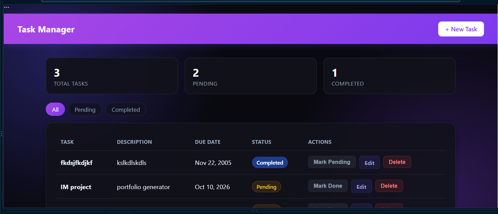

# Personal Task Manager

## Project Code
WST21-PM-2026-SF

## Student Name
Kyle Laurence D. Zamora

## Course & Year
BSIT 2nd Year

## Database Used
MySQL

## Features
- Add Task
- View Tasks
- Edit Task
- Delete Task
- Update Status

## Screenshot



---
# Project Name

A brief description of what your Laravel application does, who it is for, and its primary features.

## 🚀 Features

- **Authentication & Authorization** (e.g., Laravel Breeze/Jetstream)
- **RESTful API / Web Interface**
- **Background Jobs & Queue Management**
- **Automated Testing Setup**

## 📋 System Requirements

Ensure your system meets the following requirements before installation:

- **PHP:** >= 8.2 (or matching your environment)
- **Composer:** >= 2.x
- **Database:** MySQL 8.x / PostgreSQL / SQLite
- **Node.js & NPM:** For compiling frontend assets (Vite)

## 🛠️ Installation & Setup

Follow these steps to set up the project locally.

### 1. Clone the Repository
```bash
git clone https://github.com
cd your-repo-name
```

### 2. Install Dependencies
Install the required PHP packages via Composer and frontend packages via NPM:
```bash
composer install
npm install
```

### 3. Environment Configuration
Copy the example environment file and configure your credentials:
```bash
cp .env.example .env
```
Open the `.env` file and update your database details:
```env
DB_CONNECTION=mysql
DB_HOST=127.0.0.1
DB_PORT=3306
DB_DATABASE=your_database_name
DB_USERNAME=root
DB_PASSWORD=
```

### 4. Generate Application Key
```bash
php artisan key:generate
```

### 5. Run Database Migrations & Seeders
Create the database tables and populate them with initial or dummy data:
```bash
php artisan migrate --seed
```

### 6. Link Storage (If applicable)
If your app handles file uploads, link the storage directory to the public directory:
```bash
php artisan storage:link
```

### 7. Compile Assets & Start Development Server
Run Vite to compile frontend assets and start Laravel's built-in local server:

```bash
# Compile and watch assets
npm run dev

# In a new terminal tab, start the local server
php artisan serve
```
Your application should now be accessible at `http://127.0.0.1:8000`.

## 🧪 Running Tests

This project utilizes PHPUnit / Pest for automated testing. You can run the test suite using:
```bash
php artisan test
```

## 🐳 Docker Setup (Optional)

If your project utilizes Laravel Sail for Docker virtualization, you can start it with:
```bash
./vendor/bin/sail up -d
```

## 📄 License

The MIT License (MIT). Please see the [License File](LICENSE.md) for more information.
